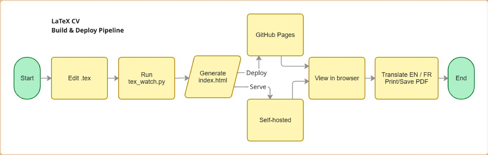

# Marion Holvoet — CV

Live at **[marionholvoet.github.io/CV](https://marionholvoet.github.io/CV/)**

---

## Overview

Single-file bilingual CV (English / French) generated from a LaTeX source.

**Architecture:**



| File | Role |
|---|---|
| `CV_Marion_Holvoet.tex` | **Source of truth** — edit this to update the CV |
| `tex_watch.py` | Converts the TeX source to `index.html` automatically on save |
| `index.html` | Generated HTML — do not edit by hand |
| `main.go` | Minimal Go web server for self-hosted deployment |
| `scripts/pre-push` | Git pre-push hook — auto-regenerates `index.html` before every push |
| `resources/photo.jpg` | Profile photo |

---

## Editing the CV

Only edit `CV_Marion_Holvoet.tex`. Run the watcher to auto-regenerate `index.html`:

```bash
# One-time regeneration
python tex_watch.py --once

# Watch mode — regenerates index.html every time the .tex file is saved
python tex_watch.py
```

Requires Python 3.9+ and `watchdog`:

```bash
pip install watchdog
```

---

## Git hooks

A `pre-push` hook is provided in `scripts/` that automatically runs `tex_watch.py --once`
and commits the updated `index.html` before every push.

**Install (Linux / macOS / Git Bash on Windows):**
```bash
cp scripts/pre-push .git/hooks/pre-push
chmod +x .git/hooks/pre-push
```

**Install (PowerShell on Windows):**
```powershell
Copy-Item scripts/pre-push .git/hooks/pre-push
```

Git for Windows runs hooks via its bundled `sh.exe`, so no `chmod` is needed on Windows.

---

## GitHub Pages deployment

GitHub Pages is configured to serve from the **`main` branch, root (`/`)**.

To publish an update:

```bash
python tex_watch.py --once   # regenerate index.html from the .tex
git add CV_Marion_Holvoet.tex index.html
git commit -m "your message"
git push
```

GitHub Pages will automatically redeploy at `https://marionholvoet.github.io/CV/`.

> **Note:** `index.html` references `resources/photo.jpg` for the profile photo.
> Make sure that file is committed and present in the repo.

---

## Self-hosted deployment (Go server)

The Go server exposes the CV at `/marion` and handles a GitHub webhook at `/exit`
for graceful remote restarts.

Linux:
```bash
cd src/resources
go build -o main main.go
./main          # starts on :12345
```

Windows:
```bash
cd src/resources
go build -o main main.go
main.exe   # starts on :12345
```

Set the `GITHUB_WEBHOOK_SECRET` environment variable to validate webhook calls.

---

## PDF download

The CV includes a **PDF** button in the top-right corner that triggers the browser
print dialog. Select *Save as PDF* to download. Colors, margins, and layout are
optimised for print and match the LaTeX PDF output.
